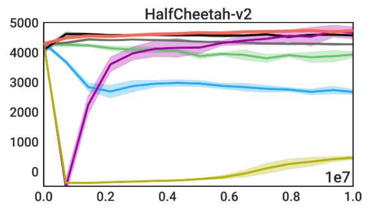
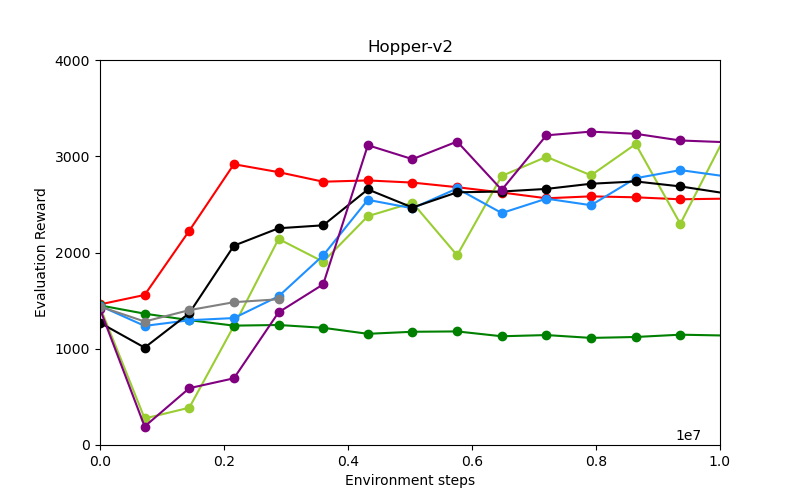
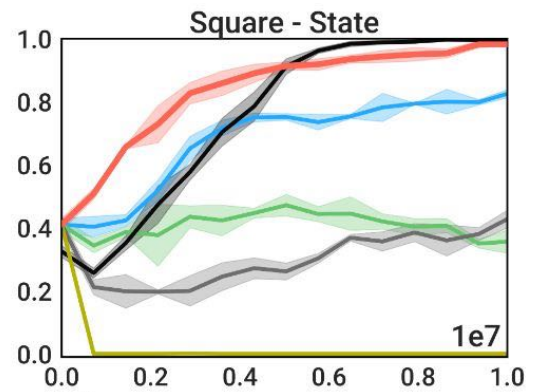
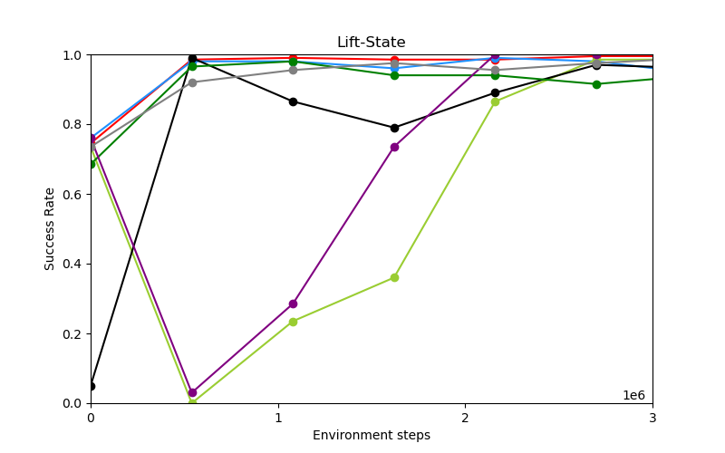
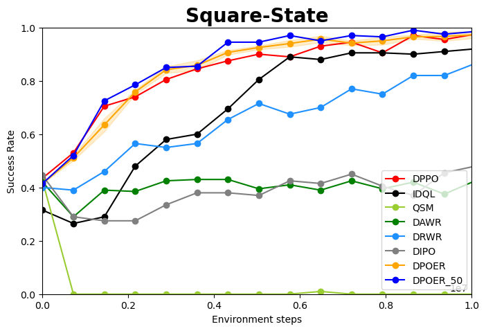
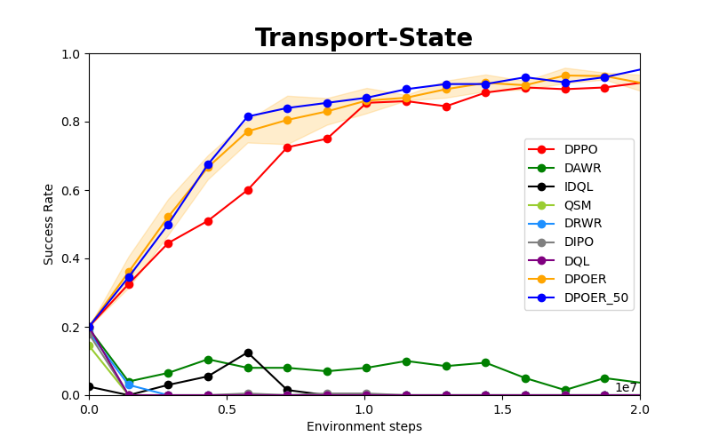

# Tensorflow implementation of the paper DPPO


## Replicated results

### 1. Comparison between replicated results and Figure 4 (comparing to other diffusion-based RL algorithms)

#### 1.1 GYM tasks
<center class="third">
    <div>
        <b>Original Results</b><br>
        
        
        
    </div>
    <br>
    <div>
        <b>Replicated Results</b><br>
        
        
        
    </div>
    <br>
    <div>
        
    <div>
</center>


#### 1.2 ROBOMIMIC tasks
<center class="forth">
    <div>
        <b>Original Results</b><br>
        
        
        
        
    </div>
    <br>
    <div>
        <b>Replicated Results</b><br>
           
        
        
        
    </div>
    <br>
    <div>
        
    <div>
</center>


### 2. Comparison between replicated results and Figure 7 (Training trajectories at the first iteration of fine-tuning)

#### 2.1 Structured exploration for DPPO

<center class="third">
    <div style="display: flex; justify-content: space-around; text-align: center;">
        <div>
            <b>Pre-training Data</b><br>
            <br>
            <br>
            
        </div>
        <div>
            <b>Original Results</b><br>
            <br>
            <br>
            
        </div>
        <div>
            <b>Replicated Results</b><br>
            <br>
            <br>
            
        </div>
    </div>
</center>


#### 2.2 Structured exploration for Gaussian

Their configuration .yaml file is absent in the ./cfg folders, with the exception of DPPO at M1. Therefore, I created a version of the missing 8 files myself, which include DPPO at M2 and M3, Gaussian at M1, M2, and M3, and GMM at M1, M2, and M3.


<center class="third">
    <div style="display: flex; justify-content: space-around; text-align: center;">
        <div>
            <b>Presented results</b><br>
            <br>
            <br>
            
        </div>
        <div>
            <b>Results by given codes</b><br>
            <br>
            <br>
            
        </div>
        <div>
            <b>Replicated Results</b><br>
            <br>
            <br>
            <!--  -->
        </div>
    </div>
</center>


#### 2.3 Structured exploration for GMM

<center class="third">
    <div style="display: flex; justify-content: space-around; text-align: center;">
        <div>
            <b>Pre-training Data</b><br>
            <br>
            <br>
            
        </div>
        <div>
            <b>Original Results</b><br>
            <br>
            <br>
            
        </div>
        <div>
            <b>Replicated Results</b><br>
            <br>
            <br>
            <!--  -->
        </div>
    </div>
</center>


## Installation 

1. Clone the repository
```console
https://github.com/NotOneRing/TEST.git
cd code
```

2. Install core dependencies with a conda environment on a Linux machine with a Nvidia GPU.
```console
conda create -n tf218_kr2 python=3.11
conda activate tf218_kr2
pip install tensorflow[and-cuda]==2.18.0 --no-cache-dir
pip install tf-keras --no-cache-dir
pip install -e .[d3il] --no-cache-dir
pip install tensorflow-probability --no-cache-dir
pip install opencv-python --no-cache-dir
pip install scikit-learn --no-cache-dir
pip uninstall torch
pip install -e .
```

3. Install specific environment dependencies (Gym / Kitchen / Robomimic / D3IL / Furniture-Bench) or all dependencies (except for Kitchen, which has dependency conflicts with other tasks).
```console
pip install -e .[gym] # or, [robomimic], [d3il],
pip install -e .[all]
```

For Robomimic: please find the anaconda path:
```
conda env list
```
This env list gives the root path of anaconda as ANACONDA_PATH.
Then take out the path of the tf218_kr2
path = ANACONDA_PATH/envs/tf218_kr2/lib/python3.11/site-packages/robomimic/utils/
```
cd path
```

Manually put the files inside the project: ./code/changed_robomimic/utils/ inside the ANACONDA_PATH/envs/tf218_kr2/lib/python3.11/site-packages/robomimic/utils/
```
cp ./code/changed_robomimic/utils/*  ANACONDA_PATH/envs/tf218_kr2/lib/python3.11/site-packages/robomimic/utils/
```
This files and command help the conversion of the robomimic environment to the Tensorflow version

4. [Install MuJoCo for Gym and/or Robomimic](installation/install_mujoco.md). [Install D3IL](installation/install_d3il.md). [Install IsaacGym and Furniture-Bench](installation/install_furniture.md)

5. Set environment variables for data and logging directory (default is `data/` and `log/`), and set WandB entity (username or team name)
```
source script/set_path.sh
```

For my case, I also use:
```
export WANDB_MODE=disabled
export HYDRA_FULL_ERROR=1
export DPPO_WANDB_ENTITY=""
export MUJOCO_PY_MUJOCO_PATH=YOUR_MUJOCO_PATH/mujoco210
export LD_PRELOAD=/usr/lib/x86_64-linux-gnu/libGLEW.so
export LD_LIBRARY_PATH=/usr/lib/x86_64-linux-gnu:$LD_LIBRARY_PATH
export PYTHONPATH=THE_ROOT_PATH_OF_THIS_PROJECT/code:$PYTHONPATH
export LD_PRELOAD=/usr/lib/x86_64-linux-gnu/libstdc++.so.6
```

You could control which GPUs to use by:
```
CUDA_VISIBLE_DEVICES=0,1
```
## Usage - Pre-training

**Note**: You may skip pre-training if you would like to use the default checkpoint (available for download) for fine-tuning.

<!-- ### Prepare pre-training data

First create a directory as the parent directory of the pre-training data and set the environment variable for it.
```console
export DPPO_DATA_DIR=/path/to/data -->
<!-- ``` -->

Pre-training data for all tasks are pre-processed and can be found at [here](https://drive.google.com/drive/folders/1AXZvNQEKOrp0_jk1VLepKh_oHCg_9e3r?usp=drive_link). Pre-training script will download the data (including normalization statistics) automatically to the data directory.
<!-- The data path follows `${DPPO_DATA_DIR}/<benchmark>/<task>/train.npz`, e.g., `${DPPO_DATA_DIR}/gym/hopper-medium-v2/train.npz`. -->

### Run pre-training with data
All the configs can be found under `cfg/<env>/pretrain/`.
<!-- To run pre-training, first set your WandB entity (username or team name) and the parent directory for logging as environment variables. -->
<!-- ```console
export DPPO_WANDB_ENTITY=<your_wandb_entity>
export DPPO_LOG_DIR=<your_prefered_logging_directory>
``` -->
```console
# Gym - hopper/walker2d/halfcheetah
python script/run.py --config-name=pre_diffusion_mlp \
    --config-dir=cfg/gym/pretrain/hopper-medium-v2
# Robomimic - lift/can/square/transport
python script/run.py --config-name=pre_diffusion_mlp \
    --config-dir=cfg/robomimic/pretrain/can
# D3IL - avoid_m1/m2/m3
python script/run.py --config-name=pre_diffusion_mlp \
    --config-dir=cfg/d3il/pretrain/avoid_m1
```

## Usage - Fine-tuning

<!-- ### Set up pre-trained policy -->

<!-- If you did not set the environment variables for pre-training, we need to set them here for fine-tuning. 
```console
export DPPO_WANDB_ENTITY=<your_wandb_entity>
export DPPO_LOG_DIR=<your_prefered_logging_directory>
``` -->
<!-- First create a directory as the parent directory of the downloaded checkpoints and set the environment variable for it.
```console
export DPPO_LOG_DIR=/path/to/checkpoint
``` -->

Pre-trained policies used in the paper can be found [here](https://drive.google.com/drive/folders/1b4eylHX3E9hKpMlKXwxjTDepNBanaI5R?usp=drive_link). Fine-tuning script will download the default checkpoint automatically to the logging directory.
 <!-- or you may manually download other ones (different epochs) or use your own pre-trained policy if you like. -->

 <!-- e.g., `${DPPO_LOG_DIR}/gym-pretrain/hopper-medium-v2_pre_diffusion_mlp_ta4_td20/2024-08-26_22-31-03_42/checkpoint/state_0.pt`. -->

<!-- The checkpoint path follows `${DPPO_LOG_DIR}/<benchmark>/<task>/.../<run>/checkpoint/state_<epoch>.pt`. -->

### Fine-tuning pre-trained policy

All the configs can be found under `cfg/<env>/finetune/`. A new WandB project may be created based on `wandb.project` in the config file; set `wandb=null` in the command line to test without WandB logging.
<!-- Running them will download the default pre-trained policy. -->
<!-- Running the script will download the default pre-trained policy checkpoint specified in the config (`base_policy_path`) automatically, as well as the normalization statistics, to `DPPO_LOG_DIR`.  -->
```console
# Gym - hopper/walker2d/halfcheetah
‘’‘
python script/run.py --config-name=ft_ppo_diffusion_mlp --config-dir=cfg/gym/finetune/halfcheetah-v2 +wandb.mode=disabled
python script/run.py --config-name=ft_ppo_diffusion_mlp --config-dir=cfg/gym/finetune/hopper-v2 +wandb.mode=disabled
python script/run.py --config-name=ft_ppo_diffusion_mlp --config-dir=cfg/gym/finetune/walker2d-v2 +wandb.mode=disabled
’‘’
# Robomimic - lift/can/square/transport
’‘‘
python script/run.py --config-name=ft_ppo_diffusion_mlp --config-dir=cfg/robomimic/finetune/can +wandb.mode=disabled
python script/run.py --config-name=ft_ppo_diffusion_mlp --config-dir=cfg/robomimic/finetune/lift +wandb.mode=disabled
python script/run.py --config-name=ft_ppo_diffusion_mlp --config-dir=cfg/robomimic/finetune/square +wandb.mode=disabled
python script/run.py --config-name=ft_ppo_diffusion_mlp --config-dir=cfg/robomimic/finetune/transport +wandb.mode=disabled
‘’‘
# D3IL - avoid_m1/m2/m3
python script/run.py --config-name=ft_ppo_diffusion_mlp --config-dir=cfg/d3il/finetune/avoid_m1 +wandb.mode=disabled ++env.render=False ++env.n_envs=1 ++train.render.num=1
python script/run.py --config-name=ft_ppo_diffusion_mlp --config-dir=cfg/d3il/finetune/avoid_m2 +wandb.mode=disabled ++env.render=False ++env.n_envs=1 ++train.render.num=1
python script/run.py --config-name=ft_ppo_diffusion_mlp --config-dir=cfg/d3il/finetune/avoid_m3 +wandb.mode=disabled ++env.render=False ++env.n_envs=1 ++train.render.num=1
```

**Note**: In Gym, Robomimic, and D3IL tasks, we run 40, 50, and 50 parallelized MuJoCo environments on CPU, respectively. If you would like to use fewer environments (given limited CPU threads, or GPU memory for rendering), you can reduce `env.n_envs` and increase `train.n_steps`, so the total number of environment steps collected in each iteration (n_envs x n_steps x act_steps) remains roughly the same. Try to set `train.n_steps` a multiple of `env.max_episode_steps / act_steps`, and be aware that we only count episodes finished within an iteration for eval. Furniture-Bench tasks run IsaacGym on a single GPU.

To fine-tune your own pre-trained policy instead, override `base_policy_path` to your own checkpoint, which is saved under `checkpoint/` of the pre-training directory. You can set `base_policy_path=<path>` in the command line when launching fine-tuning.

<!-- **Note**: If you did not download the pre-training [data](https://drive.google.com/drive/folders/1AXZvNQEKOrp0_jk1VLepKh_oHCg_9e3r?usp=drive_link), you need to download the normalization statistics from it for fine-tuning, e.g., `${DPPO_DATA_DIR}/furniture/round_table_low/normalization.pkl`. -->

See [here](cfg/finetuning.md) for details of the experiments in the paper.


### Visualization
* Furniture-Bench tasks can be visualized in GUI by specifying `env.specific.headless=False` and `env.n_envs=1` in fine-tuning configs.
* D3IL environment can be visualized in GUI by `+env.render=True`, `env.n_envs=1`, and `train.render.num=1`. There is a basic script at `script/test_d3il_render.py`.
* Videos of trials in Robomimic tasks can be recorded by specifying `env.save_video=True`, `train.render.freq=<iterations>`, and `train.render.num=<num_video>` in fine-tuning configs.

## Usage - Evaluation
Pre-trained or fine-tuned policies can be evaluated without running the fine-tuning script now. Some example configs are provided under `cfg/{gym/robomimic/furniture}/eval}` including ones below. Set `base_policy_path` to override the default checkpoint, and `ft_denoising_steps` needs to match fine-tuning config (otherwise assumes `ft_denoising_steps=0`, which means evaluating the pre-trained policy).
```console
python script/run.py --config-name=eval_diffusion_mlp \
    --config-dir=cfg/gym/eval/hopper-v2 ft_denoising_steps=?
python script/run.py --config-name=eval_{diffusion/gaussian}_mlp_{?img} \
    --config-dir=cfg/robomimic/eval/can ft_denoising_steps=?
python script/run.py --config-name=eval_diffusion_mlp \
    --config-dir=cfg/furniture/eval/one_leg_low ft_denoising_steps=?
```


## Examples of Main Baselines in original Figure 4 (User can extend to every baseline to every datasets):
```
python script/run.py --config-name=ft_dql_diffusion_mlp --config-dir=cfg/gym/finetune/halfcheetah-v2 +wandb.mode=disabled
python script/run.py --config-name=ft_dql_diffusion_mlp --config-dir=cfg/gym/finetune/hopper-v2 +wandb.mode=disabled
python script/run.py --config-name=ft_dql_diffusion_mlp --config-dir=cfg/gym/finetune/walker2d-v2 +wandb.mode=disabled
python script/run.py --config-name=ft_dql_diffusion_mlp --config-dir=cfg/robomimic/finetune/can +wandb.mode=disabled
python script/run.py --config-name=ft_dql_diffusion_mlp --config-dir=cfg/robomimic/finetune/lift +wandb.mode=disabled
python script/run.py --config-name=ft_dql_diffusion_mlp --config-dir=cfg/robomimic/finetune/square +wandb.mode=disabled
python script/run.py --config-name=ft_dql_diffusion_mlp --config-dir=cfg/robomimic/finetune/transport +wandb.mode=disabled

python script/run.py --config-name=ft_qsm_diffusion_mlp --config-dir=cfg/gym/finetune/halfcheetah-v2 +wandb.mode=disabled
python script/run.py --config-name=ft_qsm_diffusion_mlp --config-dir=cfg/gym/finetune/hopper-v2 +wandb.mode=disabled
python script/run.py --config-name=ft_qsm_diffusion_mlp --config-dir=cfg/gym/finetune/walker2d-v2 +wandb.mode=disabled
python script/run.py --config-name=ft_qsm_diffusion_mlp --config-dir=cfg/robomimic/finetune/can +wandb.mode=disabled
python script/run.py --config-name=ft_qsm_diffusion_mlp --config-dir=cfg/robomimic/finetune/lift +wandb.mode=disabled
python script/run.py --config-name=ft_qsm_diffusion_mlp --config-dir=cfg/robomimic/finetune/square +wandb.mode=disabled
python script/run.py --config-name=ft_qsm_diffusion_mlp --config-dir=cfg/robomimic/finetune/transport +wandb.mode=disabled

python script/run.py --config-name=ft_dipo_diffusion_mlp --config-dir=cfg/gym/finetune/halfcheetah-v2 +wandb.mode=disabled
python script/run.py --config-name=ft_dipo_diffusion_mlp --config-dir=cfg/gym/finetune/hopper-v2 +wandb.mode=disabled
python script/run.py --config-name=ft_dipo_diffusion_mlp --config-dir=cfg/gym/finetune/walker2d-v2 +wandb.mode=disabled
python script/run.py --config-name=ft_dipo_diffusion_mlp --config-dir=cfg/robomimic/finetune/can +wandb.mode=disabled
python script/run.py --config-name=ft_dipo_diffusion_mlp --config-dir=cfg/robomimic/finetune/lift +wandb.mode=disabled
python script/run.py --config-name=ft_dipo_diffusion_mlp --config-dir=cfg/robomimic/finetune/square +wandb.mode=disabled
python script/run.py --config-name=ft_dipo_diffusion_mlp --config-dir=cfg/robomimic/finetune/transport +wandb.mode=disabled

python script/run.py --config-name=ft_idql_diffusion_mlp --config-dir=cfg/gym/finetune/halfcheetah-v2 +wandb.mode=disabled
python script/run.py --config-name=ft_idql_diffusion_mlp --config-dir=cfg/gym/finetune/hopper-v2 +wandb.mode=disabled
python script/run.py --config-name=ft_idql_diffusion_mlp --config-dir=cfg/gym/finetune/walker2d-v2 +wandb.mode=disabled
python script/run.py --config-name=ft_idql_diffusion_mlp --config-dir=cfg/robomimic/finetune/can +wandb.mode=disabled
python script/run.py --config-name=ft_idql_diffusion_mlp --config-dir=cfg/robomimic/finetune/lift +wandb.mode=disabled
python script/run.py --config-name=ft_idql_diffusion_mlp --config-dir=cfg/robomimic/finetune/square +wandb.mode=disabled
python script/run.py --config-name=ft_idql_diffusion_mlp --config-dir=cfg/robomimic/finetune/transport +wandb.mode=disabled

python script/run.py --config-name=ft_rwr_diffusion_mlp --config-dir=cfg/gym/finetune/halfcheetah-v2 +wandb.mode=disabled
python script/run.py --config-name=ft_rwr_diffusion_mlp --config-dir=cfg/gym/finetune/hopper-v2 +wandb.mode=disabled
python script/run.py --config-name=ft_rwr_diffusion_mlp --config-dir=cfg/gym/finetune/walker2d-v2 +wandb.mode=disabled
python script/run.py --config-name=ft_rwr_diffusion_mlp --config-dir=cfg/robomimic/finetune/can +wandb.mode=disabled
python script/run.py --config-name=ft_rwr_diffusion_mlp --config-dir=cfg/robomimic/finetune/lift +wandb.mode=disabled
python script/run.py --config-name=ft_rwr_diffusion_mlp --config-dir=cfg/robomimic/finetune/square +wandb.mode=disabled
python script/run.py --config-name=ft_rwr_diffusion_mlp --config-dir=cfg/robomimic/finetune/transport +wandb.mode=disabled

python script/run.py --config-name=ft_awr_diffusion_mlp --config-dir=cfg/gym/finetune/halfcheetah-v2 +wandb.mode=disabled
python script/run.py --config-name=ft_awr_diffusion_mlp --config-dir=cfg/gym/finetune/hopper-v2 +wandb.mode=disabled
python script/run.py --config-name=ft_awr_diffusion_mlp --config-dir=cfg/gym/finetune/walker2d-v2 +wandb.mode=disabled
python script/run.py --config-name=ft_awr_diffusion_mlp --config-dir=cfg/robomimic/finetune/can +wandb.mode=disabled
python script/run.py --config-name=ft_awr_diffusion_mlp --config-dir=cfg/robomimic/finetune/lift +wandb.mode=disabled
python script/run.py --config-name=ft_awr_diffusion_mlp --config-dir=cfg/robomimic/finetune/square +wandb.mode=disabled
python script/run.py --config-name=ft_awr_diffusion_mlp --config-dir=cfg/robomimic/finetune/transport +wandb.mode=disabled
```


## Examples of Main Baselines in original Figure 5:
```
python script/run.py --config-name=ft_ppo_gaussian_mlp --config-dir=cfg/robomimic/finetune/square +wandb.mode=disabled
python script/run.py --config-name=ft_ppo_gaussian_mlp --config-dir=cfg/robomimic/finetune/transport +wandb.mode=disabled
python script/run.py --config-name=ft_ppo_gmm_mlp --config-dir=cfg/robomimic/finetune/square +wandb.mode=disabled
python script/run.py --config-name=ft_ppo_gmm_mlp --config-dir=cfg/robomimic/finetune/transport +wandb.mode=disabled
python script/run.py --config-name=ft_ppo_diffusion_unet --config-dir=cfg/robomimic/finetune/square +wandb.mode=disabled
python script/run.py --config-name=ft_ppo_diffusion_unet --config-dir=cfg/robomimic/finetune/transport +wandb.mode=disabled
python script/run.py --config-name=ft_ppo_gmm_transformer --config-dir=cfg/robomimic/finetune/square +wandb.mode=disabled
python script/run.py --config-name=ft_ppo_gmm_transformer --config-dir=cfg/robomimic/finetune/transport +wandb.mode=disabled
python script/run.py --config-name=ft_ppo_gaussian_transformer --config-dir=cfg/robomimic/finetune/square +wandb.mode=disabled
python script/run.py --config-name=ft_ppo_gaussian_transformer --config-dir=cfg/robomimic/finetune/transport +wandb.mode=disabled

python script/run.py --config-name=ft_ppo_gaussian_mlp_img --config-dir=cfg/robomimic/finetune/square +wandb.mode=disabled
python script/run.py --config-name=ft_ppo_gaussian_mlp_img --config-dir=cfg/robomimic/finetune/transport +wandb.mode=disabled
python script/run.py --config-name=ft_ppo_diffusion_unet_img --config-dir=cfg/robomimic/finetune/square +wandb.mode=disabled
python script/run.py --config-name=ft_ppo_diffusion_unet_img --config-dir=cfg/robomimic/finetune/transport +wandb.mode=disabled
python script/run.py --config-name=ft_ppo_gaussian_mlp --config-dir=cfg/robomimic/finetune/square +wandb.mode=disabled
python script/run.py --config-name=ft_ppo_gaussian_mlp --config-dir=cfg/robomimic/finetune/transport +wandb.mode=disabled
```


## Examples of Main Baselines in original Figure 7:
```
python script/run.py --config-name=pre_gaussian_mlp --config-dir=cfg/d3il/pretrain/avoid_m1 +wandb.mode=disabled
python script/run.py --config-name=pre_gaussian_mlp --config-dir=cfg/d3il/pretrain/avoid_m2 +wandb.mode=disabled
python script/run.py --config-name=pre_gaussian_mlp --config-dir=cfg/d3il/pretrain/avoid_m3 +wandb.mode=disabled
python script/run.py --config-name=pre_gmm_mlp --config-dir=cfg/d3il/pretrain/avoid_m1 +wandb.mode=disabled
python script/run.py --config-name=pre_gmm_mlp --config-dir=cfg/d3il/pretrain/avoid_m2 +wandb.mode=disabled
python script/run.py --config-name=pre_gmm_mlp --config-dir=cfg/d3il/pretrain/avoid_m3 +wandb.mode=disabled
```


## DPPO implementation

Our diffusion implementation is mostly based on [Diffuser](https://github.com/jannerm/diffuser) and at [`model/diffusion/diffusion.py`](model/diffusion/diffusion.py) and [`model/diffusion/diffusion_vpg.py`](model/diffusion/diffusion_vpg.py). PPO specifics are implemented at [`model/diffusion/diffusion_ppo.py`](model/diffusion/diffusion_ppo.py). The main training script is at [`agent/finetune/train_ppo_diffusion_agent.py`](agent/finetune/train_ppo_diffusion_agent.py) that follows [CleanRL](https://github.com/vwxyzjn/cleanrl).

### Key configurations
* `denoising_steps`: number of denoising steps (should always be the same for pre-training and fine-tuning regardless the fine-tuning scheme)
* `ft_denoising_steps`: number of fine-tuned denoising steps
* `horizon_steps`: predicted action chunk size (should be the same as `act_steps`, executed action chunk size, with MLP. Can be different with UNet, e.g., `horizon_steps=16` and `act_steps=8`)
* `model.gamma_denoising`: denoising discount factor
* `model.min_sampling_denoising_std`: , minimum amount of noise when sampling at a denoising step
* `model.min_logprob_denoising_std`: , minimum standard deviation when evaluating likelihood at a denoising step
* `model.clip_ploss_coef`: PPO clipping ratio
* `train.batch_size`: you may notice the batch size is rather large --- this is due to the PPO update being in expectation over both environment steps and denoising steps (new in v0.6).

### DDIM fine-tuning

To use DDIM fine-tuning, set `denoising_steps=100` in pre-training and set `model.use_ddim=True`, `model.ddim_steps` to the desired number of total DDIM steps, and `ft_denoising_steps` to the desired number of fine-tuned DDIM steps. In our Furniture-Bench experiments we use `denoising_steps=100`, `model.ddim_steps=5`, and `ft_denoising_steps=5`.

## Adding your own dataset/environment

### Pre-training data
Pre-training script is at [`agent/pretrain/train_diffusion_agent.py`](agent/pretrain/train_diffusion_agent.py). The pre-training dataset [loader](agent/dataset/sequence.py) assumes a npz file containing numpy arrays `states`, `actions`, `images` (if using pixel; img_h = img_w and a multiple of 8) and `traj_lengths`, where `states` and `actions` have the shape of num_total_steps x obs_dim/act_dim, `images` num_total_steps x C (concatenated if multiple images) x H x W, and `traj_lengths` is a 1-D array for indexing across num_total_steps.
<!-- One pre-processing example can be found at [`script/process_robomimic_dataset.py`](script/process_robomimic_dataset.py). -->

<!-- **Note:** The current implementation does not support loading history observations (only using observation at the current timestep). If needed, you can modify [here](agent/dataset/sequence.py#L130-L131). -->

#### Observation history
In our experiments we did not use any observation from previous timesteps (state or pixel), but it is implemented. You can set `cond_steps=<num_state_obs_step>` (and `img_cond_steps=<num_img_obs_step>`, no larger than `cond_steps`) in pre-training, and set the same when fine-tuning the newly pre-trained policy.

### Fine-tuning environment
We follow the Gym format for interacting with the environments. The vectorized environments are initialized at [make_async](env/gym_utils/__init__.py#L10) (called in the parent fine-tuning agent class [here](agent/finetune/train_agent.py#L38-L39)). The current implementation is not the cleanest as we tried to make it compatible with Gym, Robomimic, and D3IL environments, but it should be easy to modify and allow using other environments. We use [multi_step](env/gym_utils/wrapper/multi_step.py) wrapper for history observations and multi-environment-step action execution. We also use environment-specific wrappers such as [robomimic_lowdim](env/gym_utils/wrapper/robomimic_lowdim.py) and [furniture](env/gym_utils/wrapper/furniture.py) for observation/action normalization, etc. You can implement a new environment wrapper if needed.


## Acknowledgement
* [DPPO, Ren et al.](https://github.com/jannerm/diffuser): PyTorch code of DPPO
* [Diffuser, Janner et al.](https://github.com/jannerm/diffuser): general code base and DDPM implementation
* [Diffusion Policy, Chi et al.](https://github.com/real-stanford/diffusion_policy): general code base especially the env wrappers
* [CleanRL, Huang et al.](https://github.com/vwxyzjn/cleanrl): PPO implementation
* [IBRL, Hu et al.](https://github.com/hengyuan-hu/ibrl): ViT implementation
* [D3IL, Jia et al.](https://github.com/ALRhub/d3il): D3IL benchmark
* [Robomimic, Mandlekar et al.](https://github.com/ARISE-Initiative/robomimic): Robomimic benchmark
* [Furniture-Bench, Heo et al.](https://github.com/clvrai/furniture-bench): Furniture-Bench benchmark
* [AWR, Peng et al.](https://github.com/xbpeng/awr): DAWR baseline (modified from AWR)
* [DIPO, Yang et al.](https://github.com/BellmanTimeHut/DIPO): DIPO baseline
* [IDQL, Hansen-Estruch et al.](https://github.com/philippe-eecs/IDQL): IDQL baseline
* [DQL, Wang et al.](https://github.com/Zhendong-Wang/Diffusion-Policies-for-Offline-RL): DQL baseline
* [QSM, Psenka et al.](https://www.michaelpsenka.io/qsm/): QSM baseline
* [Score SDE, Song et al.](https://github.com/yang-song/score_sde_pytorch/): diffusion exact likelihood


## Improved Version
#### Improved Version of Part2
Here is the general plot of the current DPOER result:
<center class="third">
    <div style="display: flex; justify-content: space-around; text-align: center;">
        <div>
            <b>DPOER on Square and Transport</b><br>
            <br>
            <br>
        </div>
    </div>
</center>
As shown above, DPOER is slightly better than DPPO. 
DPOER results are running with

```
python script/run.py --config-name=ft_sac_ppo_diffusion_mlp_C1000 --config-dir=cfg/robomimic/finetune/square +wandb.mode=disabled
python script/run.py --config-name=ft_sac_ppo_diffusion_mlp_C10000 --config-dir=cfg/robomimic/finetune/transport +wandb.mode=disabled
python script/run.py --config-name=ft_sac_ppo_diffusion_mlp --config-dir=cfg/robomimic/finetune/can +wandb.mode=disabled
python script/run.py --config-name=ft_sac_ppo_diffusion_mlp --config-dir=cfg/robomimic/finetune/lift +wandb.mode=disabled
python script/run.py --config-name=ft_sac_ppo_diffusion_mlp --config-dir=cfg/gym/finetune/halfcheetah-v2 +wandb.mode=disabled
python script/run.py --config-name=ft_sac_ppo_diffusion_mlp --config-dir=cfg/gym/finetune/hopper-v2 +wandb.mode=disabled
python script/run.py --config-name=ft_sac_ppo_diffusion_mlp --config-dir=cfg/gym/finetune/walker2d-v2 +wandb.mode=disabled
```

Other results are still being cleared up. I am also having the parameter analysis experiment.
Furthermore, I try to further improve the efficiency and attempt different variants of DPOER.


